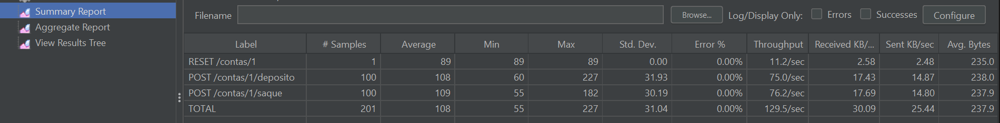
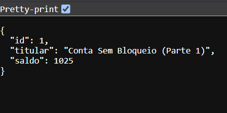
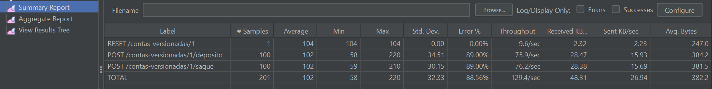
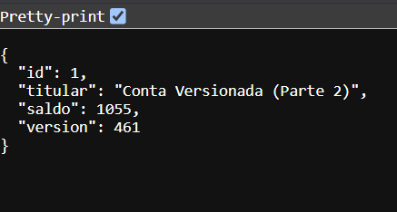

# Concorrência e Consistência em Banco de Dados com Spring Boot

Trabalho prático sobre **problemas de concorrência em sistemas transacionais** (o problema da
*Lost Update* / Atualização Perdida) e como resolvê-los com **JPA/Hibernate** usando
**Controle de Versão Otimista** (`@Version`).

O projeto expõe uma `ContaBancaria` com operações de **depósito** e **saque** em duas versões:

| Parte | Entidade | Concorrência | Comportamento sob carga |
|-------|----------|--------------|--------------------------|
| **1** | `ContaBancaria` | Apenas `@Transactional` (sem proteção) | Perde atualizações silenciosamente ❌ |
| **2** | `ContaBancariaVersionada` | `@Transactional` + `@Version` | Detecta conflito e responde **HTTP 409** ✅ |

> Todos os valores monetários usam **`BigDecimal`** (`precision = 19, scale = 2`).

---

## 🧰 Tecnologias

- Java 17
- Spring Boot 3.3.5 (Spring Web, Spring Data JPA, Bean Validation)
- Banco H2 em memória
- Maven (com Maven Wrapper incluso — não precisa instalar Maven)
- Apache JMeter 5.6.3 (testes de carga/concorrência)

---

## ▶️ Passo a passo: rodar a aplicação no Eclipse

> Este guia assume que o **Eclipse já está aberto com o projeto importado**.
> (Se ainda não importou: `File → Import… → Maven → Existing Maven Projects`, aponte para a
> pasta deste projeto e clique em `Finish`. Aguarde o Eclipse baixar as dependências.)

1. No painel da **esquerda** (Package Explorer), clique nas setinhas para abrir as pastas até chegar no arquivo principal:
   `src/main/java` → `br.com.faculdade.concorrencia` → **`ConcorrenciaBancariaApplication.java`**
2. Clique com o **botão direito** nesse arquivo → **Run As** → **Java Application**.
   *(Se você instalou o plugin Spring Tools, também pode escolher **Spring Boot App** — é a mesma coisa.)*
3. Aguarde alguns segundos. Na aba **Console** (parte de baixo da tela), quando aparecer a linha
   **`Started ConcorrenciaBancariaApplication in X seconds`**, a aplicação está **no ar**. 🎉
4. Ao iniciar, o sistema já cria sozinho duas contas com saldo `0,00`: a **Conta 1** (Parte 1) e a
   **Conta 1 versionada** (Parte 2). Você não precisa criar nada.

### ✅ Como saber se funcionou

Abra o **navegador** neste endereço:

> **http://localhost:8080/contas/1**

Deve aparecer um texto parecido com:
`{"id":1,"titular":"Conta Sem Bloqueio (Parte 1)","saldo":0.00}`

> ⚠️ **Importante:** se você abrir só **http://localhost:8080** (sem o `/contas/1`), vai surgir uma
> página de erro escrita *"Whitelabel Error Page"*. **Isso é NORMAL e esperado** — a aplicação não
> tem página inicial, apenas os endereços que começam com `/contas`. Ver o texto em `/contas/1` já
> é a prova de que está tudo certo.

### ⏹ Como parar a aplicação

Na aba **Console** do Eclipse, clique no **quadrado vermelho** (botão *Terminate*).

### 🔎 (Opcional) Ver o banco de dados pela tela do H2

1. Com a aplicação rodando, abra o navegador em **http://localhost:8080/h2-console**
2. No campo **JDBC URL**, digite exatamente: `jdbc:h2:mem:bancodb`
3. **User Name:** `sa` · **Password:** *(deixe em branco)* → clique em **Connect**
4. À esquerda aparecem as tabelas `CONTA_BANCARIA` e `CONTA_BANCARIA_VERSIONADA`.

---

## 🌐 Endpoints

### Parte 1 — Conta SEM bloqueio (`/contas`)

| Método | Rota | Descrição |
|--------|------|-----------|
| `POST` | `/contas/{id}/deposito` | Adiciona valor ao saldo |
| `POST` | `/contas/{id}/saque` | Reduz o saldo (bloqueia saldo negativo) |
| `GET`  | `/contas/{id}` | Consulta o saldo |
| `POST` | `/contas/{id}/reset?saldo=0` | Auxiliar de teste: define o saldo |

### Parte 2 — Conta VERSIONADA (`/contas-versionadas`)

| Método | Rota | Descrição |
|--------|------|-----------|
| `POST` | `/contas-versionadas/{id}/deposito` | Adiciona valor ao saldo |
| `POST` | `/contas-versionadas/{id}/saque` | Reduz o saldo (bloqueia saldo negativo) |
| `GET`  | `/contas-versionadas/{id}` | Consulta saldo + `version` |
| `POST` | `/contas-versionadas/{id}/reset?saldo=0` | Auxiliar de teste: define o saldo |

### Corpo das requisições

```json
{ "valor": 10.00 }
```

### Exemplos com `curl`

> *Opcional / avançado:* só para quem quiser testar pelo terminal. Para o trabalho, você vai usar o
> **navegador** (consultas) e o **JMeter** (depósitos e saques em massa) — não precisa de `curl`.

```bash
# depósito
curl -X POST http://localhost:8080/contas/1/deposito \
     -H "Content-Type: application/json" -d '{"valor": 100.00}'

# saque
curl -X POST http://localhost:8080/contas/1/saque \
     -H "Content-Type: application/json" -d '{"valor": 30.00}'

# consulta
curl http://localhost:8080/contas/1
```

### Códigos HTTP retornados

| Status | Quando |
|--------|--------|
| `200 OK` | Operação concluída |
| `400 Bad Request` | Corpo inválido (ex.: `valor` ausente ou ≤ 0) |
| `404 Not Found` | Conta inexistente |
| `422 Unprocessable Entity` | Saldo insuficiente para o saque |
| **`409 Conflict`** | **Conflito de concorrência otimista (só na Parte 2)** |

---

## 🧠 O que está acontecendo (a teoria do trabalho)

### Parte 1 — O problema da *Lost Update*

O serviço faz o clássico **ler → calcular → gravar**, sem nenhuma proteção:

```java
@Transactional
public ContaBancaria depositar(Long id, BigDecimal valor) {
    ContaBancaria conta = buscarEntidade(id);          // 1) lê o saldo (ex.: 100)
    BigDecimal novoSaldo = conta.getSaldo().add(valor); // 2) calcula 100 + 10 = 110
    // ... (janela onde outra thread também já leu 100)
    conta.setSaldo(novoSaldo);                          // 3) grava 110 no commit
    return conta;
}
```

Com duas requisições simultâneas sobre a **mesma conta**:

```
Thread A: lê 100 ───────────────► grava 110
Thread B:    lê 100 ──────────────────────► grava 110   (deveria ser 120!)
```

A atualização da Thread A é **sobrescrita** pela da Thread B. Resultado: **uma operação se perde**,
mesmo que o cliente tenha recebido `200 OK` nas duas. É a **Atualização Perdida**.

### Parte 2 — A solução com Lock Otimista (`@Version`)

A entidade ganha um campo `@Version`:

```java
@Version
@Column(nullable = false)
private Integer version;
```

O Hibernate passa a incluir a versão em **todo** `UPDATE`:

```sql
UPDATE conta_bancaria_versionada
   SET saldo = ?, version = ?
 WHERE id = ? AND version = ?     -- versão lida no início da transação
```

Se outra transação já alterou a linha (versão mudou), o `UPDATE` afeta **0 linhas**, o Hibernate
lança `OptimisticLockException` e o Spring a converte em
**`org.springframework.orm.ObjectOptimisticLockingFailureException`**.

Tratamos essa exceção no [`GlobalExceptionHandler`](src/main/java/br/com/faculdade/concorrencia/exception/GlobalExceptionHandler.java)
e devolvemos um **HTTP 409 Conflict** amigável:

```java
@ExceptionHandler(ObjectOptimisticLockingFailureException.class)
public ResponseEntity<ErroResponse> tratarConflitoDeVersao(...) {
    // -> 409 CONFLICT: "a conta foi alterada por outra operação simultânea. Tente novamente."
}
```

Assim, **nenhuma atualização é perdida**: ou a operação é aplicada, ou é rejeitada com 409
(e o cliente pode repetir). O saldo **nunca** fica inconsistente.

> 💡 **Atraso artificial:** para tornar o problema reproduzível, o serviço aguarda
> `app.delay-ms` (padrão **50 ms**) entre ler e gravar, alargando a janela de corrida.
> Isso **não cria** o bug — apenas o torna visível de forma confiável. Defina `app.delay-ms=0`
> em `application.properties` para desativar.

---

## 🧪 Testes de concorrência no JMeter

O arquivo **[`plano-testes-concorrencia.jmx`](plano-testes-concorrencia.jmx)** está na **raiz** do repositório.

Ele contém:

- **setUp** que reseta as duas contas para `1000,00`;
- **Thread Group "Parte 1"** → 50 threads × 2 loops disparando `deposito` (10,00) e `saque` (5,00) em `/contas/1`;
- **Thread Group "Parte 2"** → o **mesmo cenário** apontando para `/contas-versionadas/1`;
- Listeners *Summary Report*, *Aggregate Report* e *View Results Tree*.

Variáveis ajustáveis no topo do plano: `NUM_THREADS`, `LOOPS`, `VALOR_DEPOSITO`, `VALOR_SAQUE`, `SALDO_INICIAL`.

### Passo a passo no JMeter (interface gráfica)

> Este guia assume que o **JMeter já está aberto** e que a **aplicação está rodando no Eclipse**
> (seção anterior). **A ordem importa: primeiro a aplicação no ar, depois o JMeter.**

1. No JMeter, clique em **File → Open** (ou no ícone de pasta amarela na barra de cima).
2. Navegue até a pasta deste projeto e selecione o arquivo **`plano-testes-concorrencia.jmx`**
   (ele está na raiz do projeto). Clique em **Open**.
3. No painel da **esquerda** vão aparecer dois grupos: **"Parte 1 - Conta SEM Bloqueio"** e
   **"Parte 2 - Conta VERSIONADA"**.
4. Clique no **botão verde ▶ (Start)** na barra de cima — ou no menu **Run → Start**.
5. Aguarde **uns 5 segundos**: o JMeter dispara centenas de requisições simultâneas nas duas contas.
6. Veja os resultados clicando, no painel da esquerda, em:
   - **Summary Report** → uma tabela; olhe a coluna **`Error %`**.
   - **View Results Tree** → a lista de cada requisição; clique numa linha **vermelha** para ver,
     na aba *Response data*, o erro **`409 Conflict`** (isso só acontece na Parte 2).

#### ✅ Conferindo os saldos (a prova do trabalho)

Depois que o teste terminar, abra no **navegador** e anote os dois saldos:

- **Parte 1:** http://localhost:8080/contas/1 → o saldo vai estar **ERRADO** (menor do que deveria).
- **Parte 2:** http://localhost:8080/contas-versionadas/1 → o saldo vai estar **CERTO**.

#### 👀 O que você deve observar (e explicar no relatório)

| | Parte 1 (sem bloqueio) | Parte 2 (com `@Version`) |
|---|---|---|
| Coluna **Error %** no Summary Report | perto de **0%** (quase tudo "200 OK") | **alta** (muitos **409 Conflict**) |
| Saldo final no navegador | **não bate** — sumiu dinheiro ❌ | **bate exatamente** ✅ |
| Conclusão | "respondeu OK mas corrompeu o saldo" | "rejeitou os conflitos e manteve o saldo correto" |

> 🔁 **Para rodar de novo do zero:** é só clicar no ▶ outra vez. O próprio plano já reseta as duas
> contas para `1000,00` antes de começar — não precisa reiniciar a aplicação.

#### 📸 Como tirar os prints para o relatório

Use a **Ferramenta de Captura** do Windows (tecla `Windows + Shift + S`) para recortar a tela.
Os prints já capturados deste trabalho estão em [`print_results_case1/`](print_results_case1/)
(Parte 1) e [`print_results_case2/`](print_results_case2/) (Parte 2). Sugestões do que capturar: o
**Summary Report** de cada parte, um **409** na *View Results Tree* e os dois **saldos** no navegador.

---

### (Opcional) Outras formas de provar o mesmo resultado

<details>
<summary>Rodar o teste automatizado (JUnit) pelo Eclipse — sem precisar do JMeter</summary>

No Package Explorer, abra `src/test/java` → `br.com.faculdade.concorrencia` →
**`ConcorrenciaIntegrationTest.java`**, clique com o **botão direito** → **Run As → JUnit Test**.
Ele dispara 20 threads simultâneas e, na aba **Console**, mostra a Parte 1 perdendo atualizações
e a Parte 2 mantendo o saldo consistente. A aba **JUnit** fica **verde** se tudo passou.
</details>

<details>
<summary>Rodar o JMeter pela linha de comando (headless) — usuários avançados</summary>

```bash
jmeter -n -t plano-testes-concorrencia.jmx -l resultados.jtl -e -o jmeter-report
curl http://localhost:8080/contas/1
curl http://localhost:8080/contas-versionadas/1
```
</details>

---

## 📊 Relatório de Conclusão (resultados reais)

Execução real do plano (`50 threads × 2 loops` = **100 depósitos + 100 saques** por parte;
saldo inicial `1000,00`; depósito `10,00`, saque `5,00`). As duas partes foram rodadas
separadamente — os prints de cada execução estão em
[`print_results_case1/`](print_results_case1/) (Parte 1) e
[`print_results_case2/`](print_results_case2/) (Parte 2).

### Parte 1 — Conta SEM bloqueio ❌

**Summary Report (JMeter):**



| Endpoint | Amostras | HTTP 200 | HTTP 409 | Erro % |
|----------|---------:|---------:|---------:|-------:|
| `RESET /contas/1`    |   1 |   1 | 0 | 0,00 |
| `/contas/1/deposito` | 100 | 100 | 0 | 0,00 |
| `/contas/1/saque`    | 100 | 100 | 0 | 0,00 |
| **TOTAL**            | 201 | 201 | 0 | **0,00** |

```
Saldo inicial ......... 1000,00
+ 100 depositos x 10 ..  +1000,00
-  100 saques   x  5 ..   -500,00
Saldo ESPERADO ........ 1500,00
Saldo REAL ............ 1025,00   <-- ERRADO
DINHEIRO PERDIDO ......  475,00
```

**Saldo final no navegador (`GET /contas/1`):**



> **Todas** as 200 requisições retornaram `200 OK`, e ainda assim **R$ 475,00 sumiram**.
> O sistema "mentiu": reportou sucesso e corrompeu o saldo.

### Parte 2 — Conta VERSIONADA (`@Version`) ✅

**Summary Report (JMeter):**



| Endpoint | Amostras | HTTP 200 | HTTP 409 | Erro % |
|----------|---------:|---------:|---------:|-------:|
| `RESET /contas-versionadas/1`    |   1 |  1 |   0 |  0,00 |
| `/contas-versionadas/1/deposito` | 100 | 11 |  89 | 89,00 |
| `/contas-versionadas/1/saque`    | 100 | 11 |  89 | 89,00 |
| **TOTAL**                        | 201 | 23 | 178 | **88,56** |

```
Saldo inicial ......... 1000,00
+ 11 depositos x 10 ...  +110,00   (apenas os HTTP 200)
-  11 saques   x  5 ...   -55,00   (apenas os HTTP 200)
Saldo ESPERADO ........ 1055,00
Saldo REAL ............ 1055,00   <-- CERTO
DIFERENCA .............     0,00   (22 escritas aceitas; as 178 colisões viraram 409)
```

**Saldo final no navegador (`GET /contas-versionadas/1`):**



> 178 operações conflitantes foram **rejeitadas com `409 Conflict`** e revertidas.
> O saldo final é **exatamente** a soma das operações aceitas. **Nada se perdeu.**
>
> 💡 O campo `version` (aqui `461`) é o contador do lock otimista: ele soma **todas** as
> escritas bem-sucedidas desde que a aplicação subiu (incluindo execuções anteriores e os
> `reset`), por isso é maior que as 22 operações desta rodada.

### Comparativo final

| Critério | Parte 1 (sem bloqueio) | Parte 2 (`@Version`) |
|---|---|---|
| Requisições `200 OK` (depósito+saque) | 200 / 200 | 22 / 200 |
| Requisições `409 Conflict` | 0 | 178 |
| Saldo final | `1025,00` | `1055,00` |
| Bate com as operações aceitas? | **NÃO (−475,00)** | **SIM (0,00)** |
| Integridade dos dados | ❌ corrompida | ✅ preservada |

**Conclusão:** sem controle de concorrência, requisições simultâneas geram *Lost Update* — o saldo
final não corresponde à soma das operações, apesar de todas "terem sucesso". Com o **Lock Otimista
(`@Version`)**, o conflito é detectado pelo Hibernate, convertido em **HTTP 409 Conflict** e a
operação perdedora é desfeita. Trocamos *"sempre responde 200 mas corrompe os dados"* por
*"às vezes responde 409 mas os dados estão sempre corretos"* — exatamente o que se espera de um
sistema financeiro. Em produção, o cliente trataria o 409 com uma política de **retry**.

---

## 📁 Estrutura do projeto

```
.
├── plano-testes-concorrencia.jmx        <- plano JMeter (raiz, obrigatório)
├── pom.xml
├── mvnw / mvnw.cmd                       <- Maven Wrapper
├── print_results_case1/                  <- prints da Parte 1 (Summary + saldo final)
├── print_results_case2/                  <- prints da Parte 2 (Summary + saldo final)
└── src/
    ├── main/java/br/com/faculdade/concorrencia/
    │   ├── ConcorrenciaBancariaApplication.java
    │   ├── model/        ContaBancaria.java · ContaBancariaVersionada.java (@Version)
    │   ├── repository/   ContaBancariaRepository · ContaBancariaVersionadaRepository
    │   ├── service/      ContaBancariaService · ContaBancariaVersionadaService
    │   ├── controller/   ContaBancariaController · ContaBancariaVersionadaController
    │   ├── dto/          MovimentacaoRequest · ContaResponse · ErroResponse
    │   ├── exception/    GlobalExceptionHandler · SaldoInsuficiente · ContaNaoEncontrada
    │   └── config/       DataInitializer (seed das contas id=1)
    ├── main/resources/   application.properties
    └── test/java/...     ConcorrenciaIntegrationTest
```
